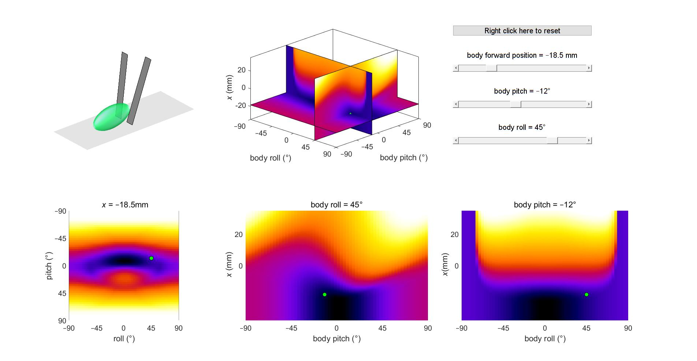

# potential_energy_landscape

Data, code, and figures accompanying publication: [10.1098/rspb.2020.2734](https://doi.org/10.1098/rspb.2020.2734)\
<em>Proceedings of the Royal Society B: Biological Sciences</em>

**Locomotor transitions in the potential energy landscape-dominated regime**\
Ratan Othayoth, Qihan Xuan, Yaqing Wang, and Chen Li*\
\*Corresponding author ([chen.li@jhu.edu](mailto:chen.li@jhu.edu))

## Instructions
1. Run `plot_landscape.m` and other plotting codes in `static_plots` to visualize static energy landscapes for obstacle traversal and self-righting shown in figure 4 of main text.
2. Run  `plot_*.m` codes in `interactive_plots` for interactive figures of potential energy landscapes

### Using interactive plots
- Interactive figures can be used to visualize orthogonal cross-sections of potential energy landscape in the space of three system degrees of freedom.
- For example, for beam energy landscape (image below), potential energy landscape is visualized in the space of body forward position <em>x</em>, body roll, and body pitch.      

- Adjust the slider position to change system state shown in top left panel (and by the green dots on landscape panels).
- System state and plots can be reset to the initial state by right-clicking on the button on top right corner

## Additional information
- Detailed steps to calculate potential energy landscape ([see supplementary text](https://doi.org/10.6084/m9.figshare.14386855))
- [Video abstact](http://www.youtube.com/watch?v=xqFAeN9MlnQ)
- [Overview video](https://youtu.be/xus_Xs-Xpvw)

